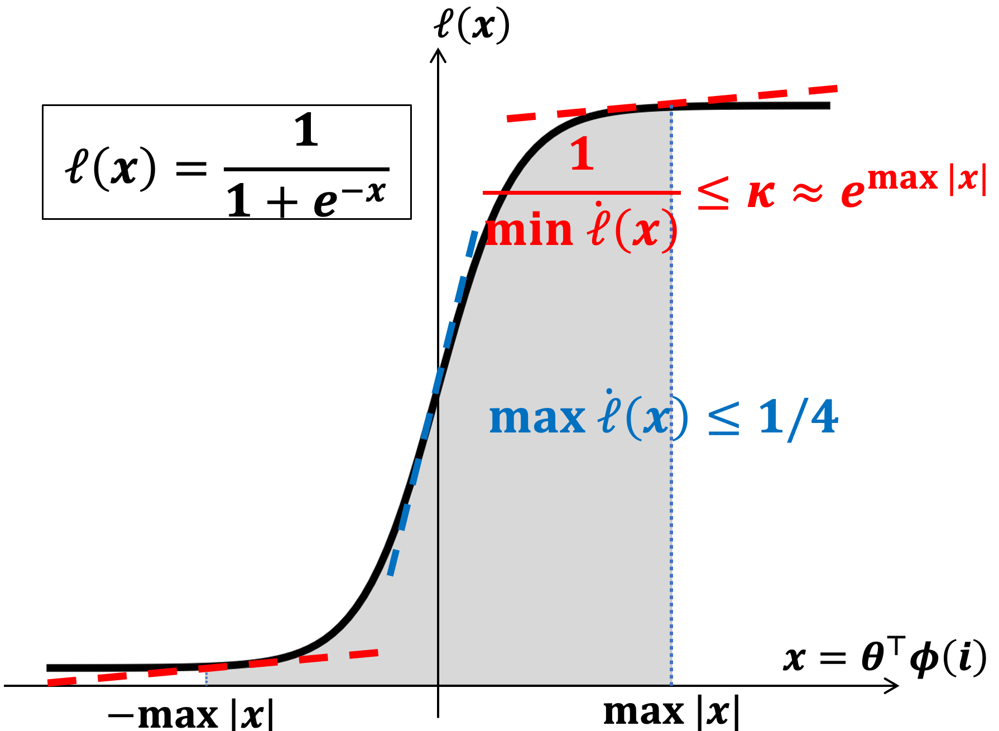

# Combinatorial Logistic Bandits Implementation

This repository contains Python implementations of algorithms from the paper *"Combinatorial Logistic Bandits"*. These algorithms address the Combinatorial Logistic Bandit (CLogB) problem, a framework for online decision-making with nonlinear reward structures, applicable to scenarios like content delivery networks and online learning to rank.

## Overview

- The CLogB problem involves a learner selecting combinatorial actions (super arms) over ( T ) rounds to maximize cumulative rewards, using a logistic model with a sigmoid link function to capture nonlinear relationships. 

  

  *Illustration of a sigmoid function with linear predictor x=θΦ(i) as input. The larger the |x|, the flatter the curve is, and the higher the nonlinearity level κ, where κ grows exponentially fast w.r.t |x|.*

- The code simulates a cascading bandit reward model, where the learner selects a super arm of size ( k_A ), observes feedback until a satisfactory item is found, and updates the model using Maximum Likelihood Estimation (MLE).


## Requirements

- Python 3.8+
- NumPy
- Matplotlib
- SciPy

Install dependencies using:

```bash
pip install numpy matplotlib scipy
```

## Usage

Each script is standalone and can be run directly. They simulate the CLogB problem with the following default parameters:

- Number of base arms ( n_s ): 500
- Super arm size ( k_A ): 15
- Time horizon ( T ): 2000
- Feature dimension ( dim_A ): 10
- Noise level: 0.01
- Regularization parameter ( L ): 1.0
- Nonlinearity coefficient ( \kappa ): Estimated as ( 4 \exp(L) )
- Confidence parameter ( \delta ): ( 1/T )

To run a script, execute:

```bash
python VA-CLogUCB.py
```

or similarly for `EVA-CLogUCB.py`.


## Optimizations

The primary computational bottleneck is the Maximum Likelihood Estimation (MLE), which involves gradient computation, Hessian matrix updates, and linear system solving. The following optimizations have been implemented:

1. **Vectorized Computations**:
   - Historical data processing in `compute_mle` and related functions uses NumPy's vectorized operations to avoid loops, improving efficiency for large datasets.
2. **Sliding Window**:
   - The `history` list, which stores observations, grows linearly with time, leading to O(t)  or higher complexity for Hessian updates and MLE computation.
   - A sliding window limits `history` to the most recent 1000 entries (`window_size=1000`), capping the computational cost.
   - Larger windows improve performance (better MLE accuracy) but increase computation time. For larger k_A, a smaller window (e.g., 500) can be used to balance performance and speed.
3. **Incremental Matrix Updates**:
   - The Gram and Hessian matrices (`Gram` and `H_t`) are updated incrementally for each observation, avoiding recomputation from scratch.

### Further Optimization Opportunities

- **GPU Acceleration**:
  - Replace NumPy with `CuPy` or `JAX` for GPU-accelerated matrix operations and sigmoid computations, significantly reducing runtime on compatible hardware.
  - Example: Use `cupy.linalg.inv` for matrix inversion in `compute_mle`.
- **Sparse Matrix Handling**:
  - If feature vectors are sparse, use SciPy's sparse matrix module (`scipy.sparse`) to reduce memory and computation costs.
- **Parallelization**:
  - Parallelize UCB computations across base arms using `joblib` or `multiprocessing` for large ( n_s ).

## Burn-in Stage in EVA-CLogUCB

The EVA-CLogUCB algorithm includes a burn-in stage of length ( T_0 ), which constructs a nonlinearity-restricted region to eliminate the need for nonconvex projections.

##### Choosing ( T_0' )

- **Theoretical Guidance**: The worst-case ( T_0 ) ensures the nonlinearity-restricted region ( Q ) contains the true parameter with high probability, but it scales with κ and d, making it overly conservative.

- Practical Choice: Set ( T_0' ) based on the problem scale.

  

## Notes

- **Random Seed**: Freely change the seed for different random instances.
- **Cascading Bandit Model**: The reward model assumes a cascading bandit setting, where feedback stops after the first satisfactory item is found, consistent with Section 3.2 of the paper. You can freely change the reward model by yourself.
- **Numerical Stability**: Matrix inversions use `np.linalg.pinv` as a fallback for singular matrices, and sigmoid outputs are clipped to avoid numerical issues.

## References

If you think this work is helpful to your research, please feel free to cite our paper.

```
@article{liu2024combinatorial,
  title={Combinatorial Logistic Bandits},
  author={Liu, Xutong and Dai, Xiangxiang and Wang, Xuchuang and Hajiesmaili, Mohammad and Lui, John},
  journal={arXiv preprint arXiv:2410.17075},
  year={2024}
}
```
